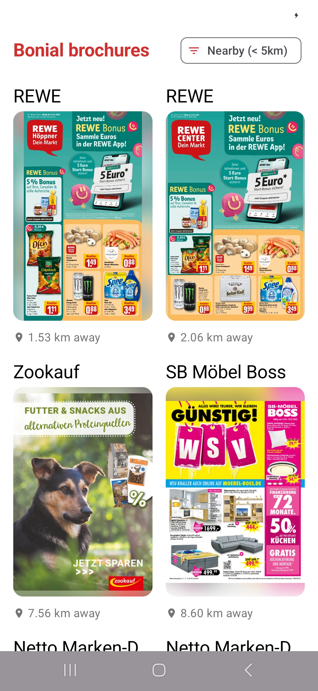
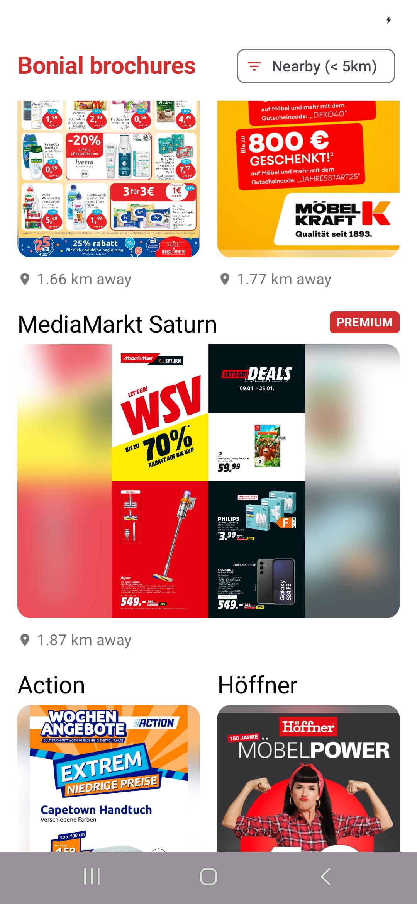

# Bonial Code Challenge 📱

This repository contains my submission for the Bonial Android Code Challenge. It is a modern Android
application built with **Jetpack Compose**, following **Clean Architecture** principles and
modularization best practices.

## 🏗 Architecture

The project follows a **Multi-Module** architecture to enforce separation of concerns and
scalability.

[Guide to App Architecture](https://developer.android.com/topic/architecture)

### Modules

* **:app**: The application entry point. Handles dependency injection wiring and initialization.
* **:feature:brochures**: Contains the main feature logic for displaying brochures. It is
  self-contained and follows **Clean Architecture**:
    * **Presentation**: `BrochuresViewModel` (MVVM) and Jetpack Compose UI.
    * **Domain**: `GetBrochuresUseCase` and Repository interfaces. Pure Kotlin, no Android
      dependencies.
    * **Data**: Repository implementation, API definitions, and DTO mappers.
* **:core:network**: A reusable network module providing the HTTP client and Ktorfit configuration.

### Design Patterns & Tech Stack

* **Language**: Kotlin
* **UI**: Jetpack Compose
* **DI**: Koin for Dependency Injection
* **Concurrency**: Coroutines & Flow
* **Network**: Ktorfit & OkHttp
* **Image Loading**: Coil
* **Architecture**: MVVM + Clean Architecture

## 📱 Screens

---
*Created by Siham EL GHAZY*
